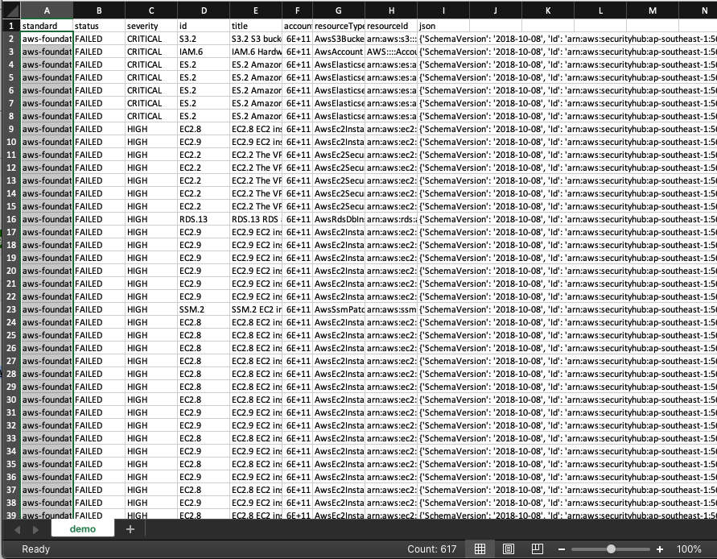

# Get Security Hub findings with details
A lambda to get all the findings in Security Hub and compile them into CSV with details
## Problem Statement
if you want to export the findings out and do further analysis, you have a lot of manual steps to work on before you can export all the findings. First, you have to one-by-one export out the findings in the list but it does not contain the AWS resource names and details. In order to do that, you have to click into each finding and export out the details one-by-one for each AWS resource. It is highly not scalable if you have e.g. 40 findings and each finding has 10 AWS resources.
## Challenge
To have an easier (and scripted) way to export out the findings and keep the details in multiple rows in CSV.
# Solution - Lambda
Since we can pull all the details and records out of security hub via the [awscli](https://docs.aws.amazon.com/securityhub/latest/userguide/finding-retrieve-api-cli.html), you can also use a [script](lambda.py) to pull and parse the data to CSV. Since the data is very sensitive, I also put the CSV into the Amazon S3 and get the [presigned URL from the API](https://boto3.amazonaws.com/v1/documentation/api/latest/guide/s3-presigned-urls.html). 

I prefer to use python boto3 library because it is easier to understand and the documentation is very clear. In this case, I am going to use the `get_findings` to pull out the data I want. Subsequently, I write the data into a tmp file and later on, parse that to S3 object. You can refer to the actual source code [here](lambda.py)
# Sample Result

